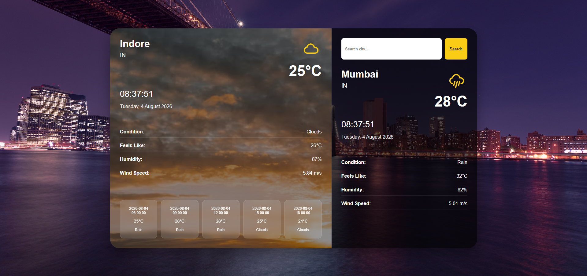
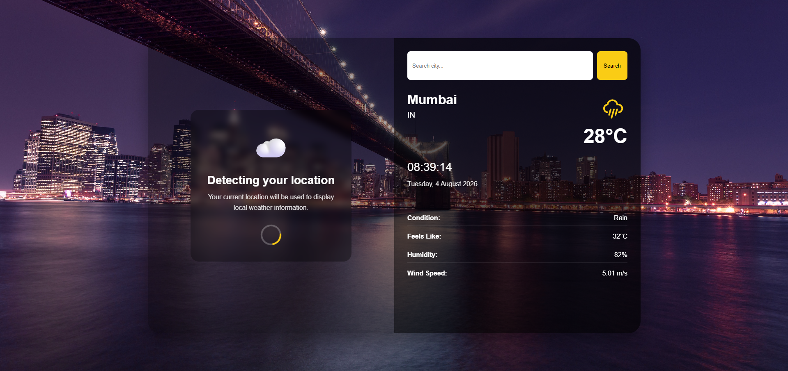
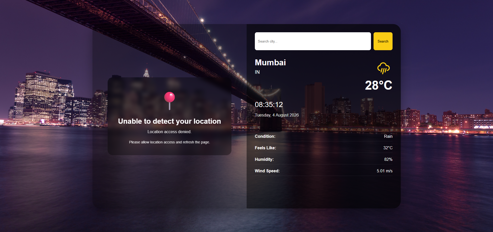

# 🌤️ Weather App

A responsive weather dashboard built with **React.js**, **Vite**, and the **OpenWeather API**.

The application detects the user's current location and displays real-time weather information. Users can also search for weather conditions in different cities, view local time, weather details, and a short-term forecast.

## 🌐 Live Demo

👉 https://weather-app-one-eta-62.vercel.app

## 📂 GitHub Repository

👉 https://github.com/kapilchandrawal/weather-app

---

## ✨ Features

- 📍 Automatic location detection using browser Geolocation API
- 🌡️ Current temperature
- 🌤️ Dynamic weather icons
- 🌧️ Weather condition information
- 💧 Humidity information
- 🌬️ Wind speed
- 🤗 Feels-like temperature
- 🕐 Live local time for the selected city
- 📅 Local date based on city timezone
- 🔎 Search weather by city
- 🌎 Displays country code for searched cities
- 🌦️ Short-term weather forecast
- 🖼️ Dynamic background based on weather condition
- ⏳ Loading and fallback UI while detecting location
- ❌ Error handling for failed API requests
- 📱 Responsive layout for different screen sizes
- 🔐 API key managed using environment variables

---

## 📸 Screenshots

### Weather Dashboard

Displays current-location weather information, dynamic weather backgrounds, local time, weather details, and a short-term forecast.



### Location Detection

Shows the loading state while the application requests the user's location and fetches local weather information.



### Location Access Denied

Displays a fallback state when the user denies location access while keeping city search available.



---

# 🛠️ Tech Stack

### Frontend

- React.js
- JavaScript
- HTML5
- CSS3

### Build Tool

- Vite

### API

- [OpenWeather API](https://openweathermap.org/api)

### Other

- Browser Geolocation API
- React Icons / Weather Icons
- Git & GitHub
- Vercel

---

## 🚀 Getting Started

### 1. Clone the repository
```bash
git clone https://github.com/kapilchandrawal/weather-app.git
```

### 2. Navigate to the project directory
```bash
cd weather-app
```

### 3. Install dependencies
```bash
npm install
```

### 4. Configure environment variables
Create a `.env` file in the root directory of the project (you can use `.env.example` as a reference) and add your OpenWeather API key:

#### Get an OpenWeather API key

1. Go to the [OpenWeather website](https://openweathermap.org/).
2. Create an account or log in to your existing account.
3. Open your account dashboard and navigate to the **API Keys** section.
4. Create or copy your API key.

Add the API key to your `.env` file:

```env
VITE_WEATHER_API_KEY=your_openweather_api_key
```

> **Note:** Replace `your_openweather_api_key` with your actual OpenWeather API key. The `.env` file is ignored by Git for security, so you must create it manually.

### 5. Start the development server
```bash
npm run dev
```

---

# 📁 Project Structure

```text
weather-app/
│
├── public/
│
├── screenshots/
│   ├── location-access-denied.png
│   ├── location-detection.png
│   └── weather-dashboard.png
│
├── src/
│   ├── assets/
│   │   └── backgrounds/
│   │
│   ├── components/
│   │   ├── CurrentLocationCard.jsx
│   │   ├── ForecastList.jsx
│   │   ├── LiveClock.jsx
│   │   ├── SearchBar.jsx
│   │   └── SearchWeatherCard.jsx
│   │
│   ├── services/
│   │   └── weatherService.js
│   │
│   ├── styles/
│   │   ├── App.css
│   │   └── WeatherCard.css
│   │
│   ├── utils/
│   │   ├── backgroundImages.js
│   │   ├── dateBuilder.js
│   │   ├── timeUtils.js
│   │   └── weatherIcons.js
│   │
│   ├── App.jsx
│   └── main.jsx
│
├── .env.example
├── .gitignore
├── eslint.config.js
├── index.html
├── package-lock.json
├── package.json
├── README.md
└── vite.config.js
```
---

## 👨‍💻 Author

**Kapil Chandrawal**

- GitHub: https://github.com/kapilchandrawal
- LinkedIn: https://www.linkedin.com/in/kapilchandrawal/
